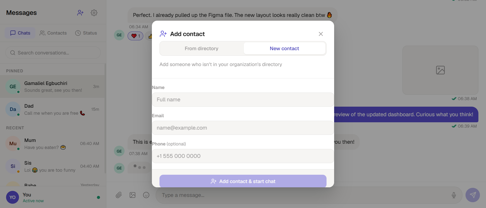
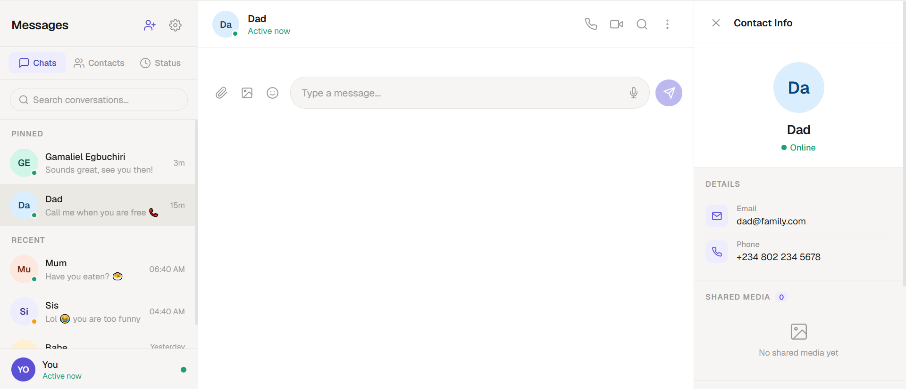
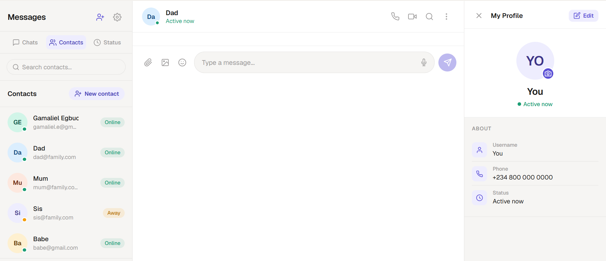
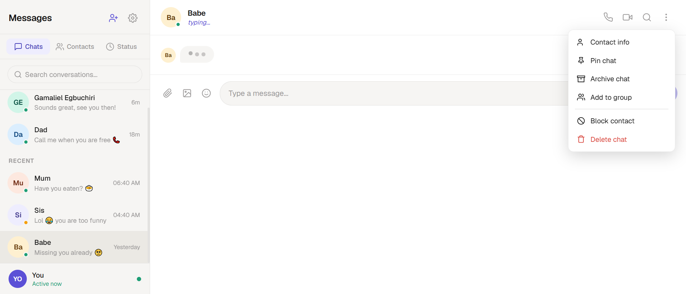
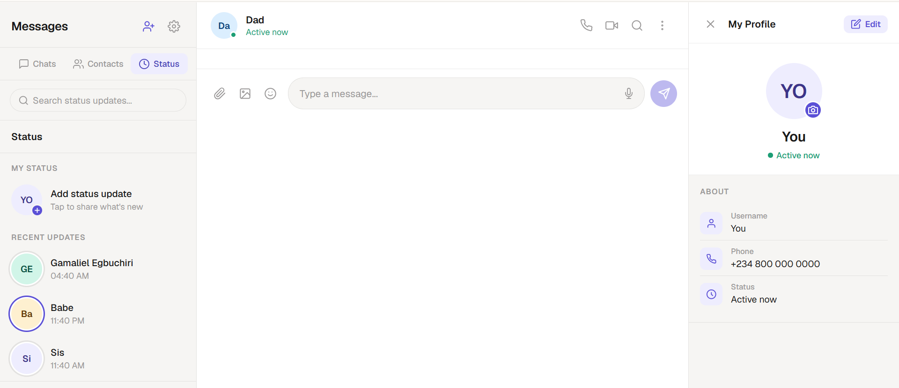

<div align="center">

# 💬 ChatApp

**A WhatsApp-inspired messaging UI built with Angular 19.**  
Clean design · Persistent state · Zero third-party UI libraries

[](https://your-live-url.github.io/chat-app)
[](https://github.com/YOUR_USERNAME/chat-app)
[-orange?style=for-the-badge)](https://github.com/Gammii90210)

---

*README · Educational Project · Gamaliel (Gammii90210)*

| Field | Details |
|---|---|
| **Repo** | github.com/YOUR_USERNAME/chat-app |
| **Tech** | Angular 19 · TypeScript · SCSS — zero external UI libraries |
| **Storage** | `localStorage` (browser persistence) |
| **Author** | Gamaliel (Gammii90210) · Educational purposes |
| **Inspired by** | WhatsApp |

> This project was built to explore modern frontend architecture with Angular Signals, reactive state management, and component-driven UI design — no backend, no UI framework, no shortcuts.

</div>

---

## Table of Contents

- [Overview](#overview)
- [Feature Showcase](#feature-showcase)
- [Tech Stack](#tech-stack)
- [Project Structure](#project-structure)
- [Getting Started](#getting-started)
- [Design System](#design-system)
- [Component Breakdown](#component-breakdown)
- [State Management](#state-management)
- [Roadmap](#roadmap)

---

## Overview

**ChatApp** is a fully interactive, frontend-only messaging application inspired by WhatsApp. It replicates the core experience of a modern chat app — conversations, contacts, statuses, emoji reactions, presence indicators, and more — using only Angular 19 and hand-crafted SCSS.

The app features a three-panel layout (sidebar · chat area · info panel), persistent state via `localStorage`, and reactive updates powered by Angular Signals — all with zero third-party component libraries.

---

## Feature Showcase

### Chats — Pinned & Recent Conversations

The sidebar organises all conversations into two clearly labelled sections: **PINNED** and **RECENT**. Each row shows the contact's colour-coded avatar, name, last message preview, timestamp, and an unread badge count rendered as a purple pill. A persistent **"You"** avatar sits at the bottom of the sidebar as a clickable entry point to your own profile.

---

### Add Contact Modal



The **Add contact** modal offers two distinct flows via a segmented tab toggle:

- **From directory** — Search the pre-populated organisation directory by name or email. Contacts already added display a green **✓ Added** badge and are non-selectable, preventing duplicates.
- **New contact** — A clean three-field form with **Name**, **Email**, and an optional **Phone** field. Submitting via the **Add contact & start chat** CTA instantly creates the contact and opens a conversation.

The backdrop is clickable to dismiss, and the name field auto-focuses on open.

---

### Contact Info Panel



Clicking a contact's name in the chat header slides open a **Contact Info** right panel — without navigating away from the conversation. The panel displays:

- Large colour-coded avatar and contact name
- **Online / Away / Offline** status badge
- **Email** and **Phone** with labelled icon rows
- **Shared Media** section with a count badge ("0" when empty, grid view when populated)
- **Documents** section placeholder
- **Message** and **Block** action buttons at the bottom

Available for every contact, including those just created via the New contact form.

---

### Contacts List & User Profile



The **Contacts tab** lists all saved contacts with their avatar, name, email, and a coloured status pill (Online / Away / Offline). A **New contact** button in the header opens the add contact modal directly. Each row has a hover-revealed info (ⓘ) button to open that contact's info panel.

Clicking the **"You"** avatar in the sidebar footer opens the **My Profile** right panel, which shows:

- Your avatar with a camera icon for photo upload
- Username, phone number, and current status
- An **Edit** button in the panel header for inline editing of your details

---

### Contact Dropdown Menu



Clicking the **⋮** (three-dot) icon in the chat header reveals a polished dropdown menu with six contextual actions. Labels update dynamically based on current state (e.g. "Pin chat" becomes "Unpin chat" once pinned). Destructive actions are visually separated by a divider and styled in red.

| Action | Behaviour |
|---|---|
| Contact info | Opens the Contact Info right panel |
| Pin chat | Moves the conversation to the Pinned section |
| Archive chat | Removes the conversation from the main list |
| Add to group | Stub — notifies with a toast |
| Block contact | Destructive — separated by a divider |
| Delete chat | Styled in red, permanently removes the conversation |

The menu closes automatically on any outside click.

---

### Status Tab



The **Status** tab provides a WhatsApp-style status experience:

- **MY STATUS** — A prominent "Add status update" row with a **+** badge, sub-labelled "Tap to share what's new"
- **RECENT UPDATES** — A chronological list of contacts who have posted status updates, showing their avatar and the time of the update
- A dedicated **Search status updates...** field at the top filters the list in real time
- The search placeholder changes context-aware per tab (conversations / contacts / statuses)

---

## Tech Stack

| Layer | Technology |
|---|---|
| Framework | Angular 19 (standalone components) |
| Language | TypeScript 5.7 |
| Styling | SCSS — component-scoped + global design tokens |
| Reactivity | Angular Signals · `computed()` · `effect()` |
| Persistence | `localStorage` via `StorageService` |
| Forms | `FormsModule` (`ngModel`) |
| Build | Angular CLI (`ng build` / `ng serve`) |
| Testing | Karma + Jasmine |

> No Angular Material, PrimeNG, or any other UI component library is used. Every element is hand-rolled.

---

## Project Structure

```
src/
├── app/
│   ├── components/
│   │   ├── sidebar/                  # Tab bar, search, chat list, footer avatar
│   │   ├── conversation-item/        # Single chat row — avatar, preview, badge
│   │   ├── chat-header/              # Contact name (→ info panel), ⋮ dropdown
│   │   ├── message-list/             # Thread — day dividers, bubbles, typing dot
│   │   ├── message-input/            # Compose bar — attach, emoji, mic, send
│   │   ├── contact-info-panel/       # Right panel — details, media, action buttons
│   │   ├── my-profile-panel/         # Right panel — your profile + inline edit
│   │   ├── contacts-panel/           # Contacts tab — list + per-row info button
│   │   ├── status-panel/             # Status tab — post / view / delete updates
│   │   ├── add-contact-modal/        # Two-mode modal — directory + new contact form
│   │   ├── context-menu/             # Right-click floating overlay menu
│   │   └── toast/                    # 2.2 s transient notification banner
│   ├── services/
│   │   ├── chat.service.ts           # All signals, computed views, and actions
│   │   └── storage.service.ts        # Typed localStorage wrapper
│   ├── models/
│   │   └── chat.models.ts            # TypeScript interfaces and type aliases
│   ├── app.component.*               # Root shell — three-panel flex layout
│   └── app.config.ts                 # Angular standalone bootstrapping
├── styles.scss                       # Global CSS tokens, reset, dark mode
└── index.html
```

---

## Getting Started

**Prerequisites:** Node.js 18+ and npm.

```bash
# 1. Clone the repository
git clone https://github.com/YOUR_USERNAME/chat-app.git
cd chat-app

# 2. Install dependencies
npm install

# 3. Start the development server
npm start
# → App runs at http://localhost:4200

# 4. Build for production
npm run build
```

---

## Design System

All visual decisions are derived from a single design token set declared at `:root` in `styles.scss`. This means colours, surfaces, and states are consistent across every component without duplication.

```scss
--accent:            #5b50d6   /* purple — buttons, badges, active states   */
--accent-subtle:     #eeedfe   /* tinted backgrounds, icon wells            */
--online:            #1d9e75   /* green presence indicator                  */
--surface-primary:   #ffffff   /* chat area and panel backgrounds           */
--surface-secondary: #f5f4f0   /* sidebar and right-panel background        */
--surface-hover:     #f0eeeb   /* list row hover                            */
--surface-active:    #ebe9e4   /* selected / active row                     */
--text-primary:      #1a1a1a
--text-secondary:    #4a4a4a
--text-muted:        #9a9898
--border:            rgba(0,0,0,0.08)
```

**Dark mode** values are declared in `@media (prefers-color-scheme: dark)` — no JavaScript toggle required.

**Colour avatars** — contacts are assigned one of seven colour names (`teal`, `blue`, `coral`, `purple`, `amber`, `green`, `pink`) resolved purely in CSS via `[data-color]` attribute selectors. No colour logic lives in TypeScript.

**Presence dots** — a small dot anchored to the avatar corner using `[data-status]` attribute selectors: `online` → green, `away` → amber, `offline` → grey. Applied consistently across every surface.

---

## Component Breakdown

| Component | Responsibility |
|---|---|
| `AppComponent` | Root flex shell hosting sidebar, chat panel, and optional right panel |
| `SidebarComponent` | Tab switching, unified search, conversation list, "You" footer avatar |
| `ConversationItemComponent` | Single row: avatar, name, preview, timestamp, unread badge |
| `ChatHeaderComponent` | Clickable contact name → info panel, presence subtitle, action buttons, ⋮ dropdown |
| `MessageListComponent` | Thread with day dividers, sent/received bubbles, emoji reactions, typing indicator |
| `MessageInputComponent` | Compose bar: file attach, image, emoji popover, text input, mic stub, send |
| `ContactInfoPanelComponent` | Sliding right panel: avatar hero, details, shared media grid, docs, action buttons |
| `MyProfilePanelComponent` | Sliding right panel: avatar with camera icon, username, phone, status, inline edit |
| `ContactsPanelComponent` | Contacts tab: list with coloured status pills and per-row info button |
| `StatusPanelComponent` | Status tab: add status prompt, recent updates list, real-time search |
| `AddContactModalComponent` | Segmented modal: directory search tab + new contact form tab |
| `ContextMenuComponent` | Floating right-click menu with dynamically generated, state-aware actions |
| `ToastComponent` | 2.2-second auto-dismissing banner for stub-action feedback |

---

## State Management

All state lives in `ChatService` using Angular Signals — no NgRx, no RxJS, no external state library.

```
signal<T>()     →  mutable state (conversations, contacts, active tab, right panel)
computed<T>()   →  derived views (pinned list, filtered search, right-panel contact)
effect()        →  automatic localStorage sync whenever any signal changes
```

Key signals:

| Signal | Purpose |
|---|---|
| `_conversations` | Full list of all conversations and their messages |
| `activeConversationId` | Which chat is currently open |
| `rightPanel` | `'none'` / `'contact-info'` / `'my-profile'` |
| `rightPanelContactId` | Which contact's details to display in the info panel |
| `activeTab` | `'chats'` / `'contacts'` / `'status'` |

`StorageService` wraps `localStorage` with typed helpers. Three data slices are persisted automatically — `contacts`, `conversations`, and `statuses` — and rehydrated from storage on every page load.

---

## Roadmap

- [ ] Voice & video calling (WebRTC)
- [ ] File and image attachment upload
- [ ] In-conversation message search
- [ ] Group chat creation
- [ ] Settings panel — notification preferences, manual theme toggle
- [ ] End-to-end encryption
- [ ] Push notifications (PWA / Service Worker)
- [ ] Backend / real-time sync (WebSocket or Firebase)

---

<div align="center">

Built with Angular 19 · Inspired by WhatsApp · Made by [Gamaliel Egbuchiri (Gammii90210)](https://github.com/Gammii90210)

</div>
